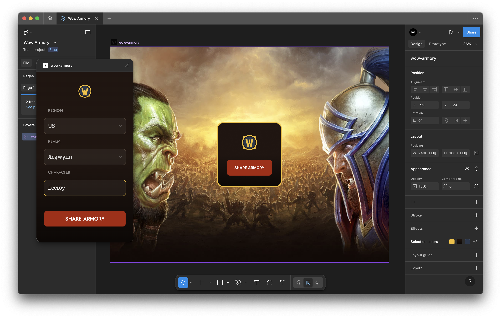
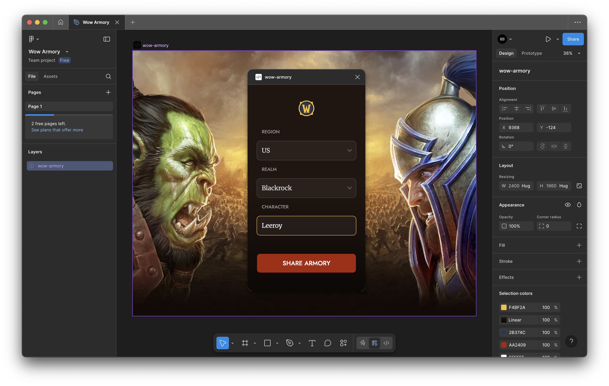

# Wow Armory

WoW Armory is a World of Warcraft-themed Figma widget that brings the fantasy of Azeroth directly into your design workspace. Perfect for fans and guildmates, it lets you share and explore player profiles, inspect gear sets, rate epic transmogs, and proudly display your allegiance to either the Horde or Alliance.

## Key Features

**Player Profiles** \
Showcase WoW character details.

**Gear Inspection** \
View and share armor sets, weapons, and item details.

**Transmog Ratings** \
Vote on and rate your favorite transmogs.

**Faction Pride** \
Choose your side — Horde or Alliance — with themed visuals.

**Fun Social Element** \
Great for gaming communities and design collaborations.

A must-have widget for WoW players, guilds, and designers who want to bring a touch of Azeroth into Figma.